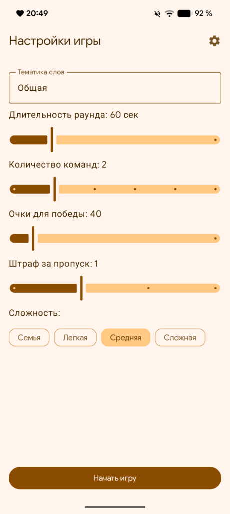
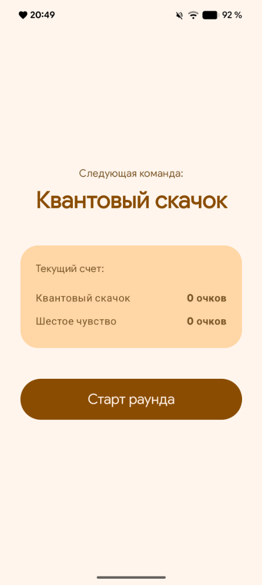
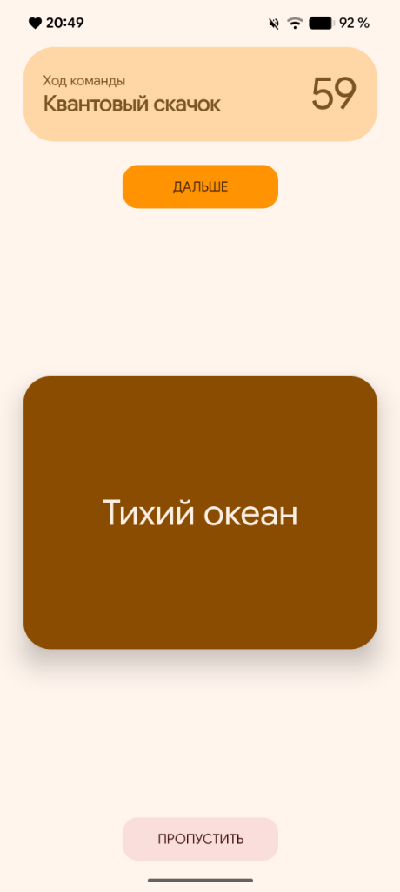
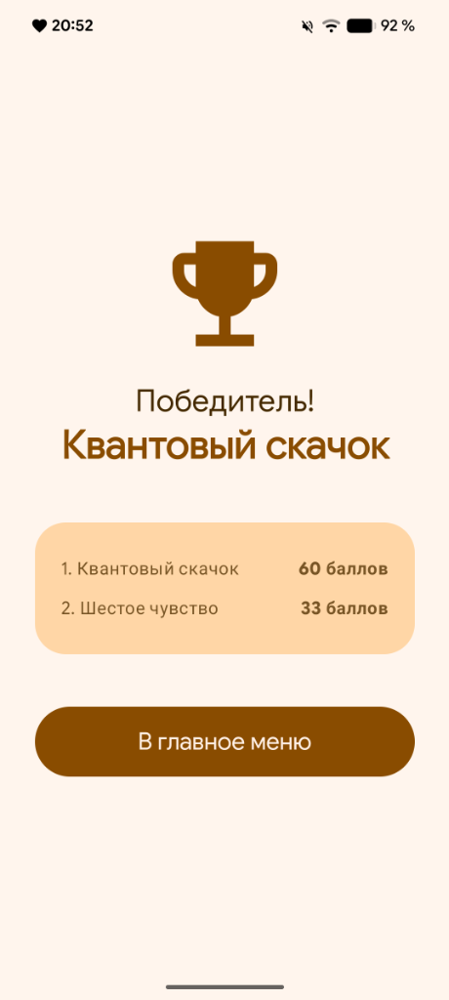
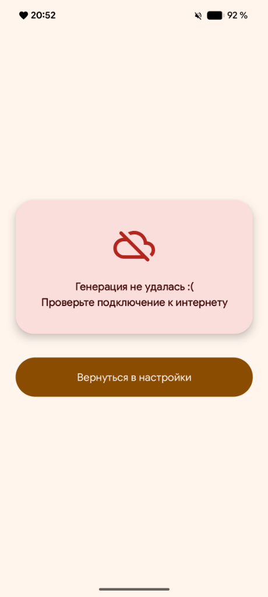

# Alias You 🎲

<p align="center">
  
  
  
  
  
</p>

<p align="center">
  <b>Современная игра Alias (Шляпа / Скажи иначе) на Kotlin и Jetpack Compose с генерацией слов и команд на базе искусственного интеллекта Google Gemini.</b>
</p>

---

## 📱 Скриншоты

<p align="center">
  
  
  
  
  
</p>

<p align="center">
  <i>Настройки игры &bull; Передача хода &bull; Карточка со словом &bull; Результаты матча &bull; Обработка ошибок</i>
</p>

---

## ✨ Особенности

- 🧠 **Бесконечная генерация через Gemini AI:** слова генерируются нейросетью (`gemini-3.5-flash-lite`) под любую заданную тему — от «Кино» и «IT» до самых безумных фантазий.
- 🚫 **Умная дедупликация:** приложение хранит историю сыгранных слов и передаёт её модели в список исключений, гарантируя отсутствие повторов между раундами и партиями.
- 🎭 **Креативные команды:** нейросеть придумывает забавные и атмосферные названия команд к каждой игре.
- 🎨 **Дизайн Material You:** полная интеграция с Material 3: скруглённые формы, адаптивная палитра под динамические цвета Android 12+ и системную тему.
- 👆 **Физика жестов:** карточки со словами смахиваются интуитивными свайпами:
  - **Свайп вверх** — слово отгадано (+1 балл);
  - **Свайп вниз** — пропуск со штрафом.
- ⏰ **Звуковой таймер и «последнее слово»:** аудио-сигнал по окончании времени и возможность отдать очко любой команде за последнее слово.
- 📳 **Тактильный виброотклик (Haptic Feedback):** реалистичные микро-вибрации при свайпах, перемещении слайдеров настроек и переключении экранов.
- 🛡 **Безопасность API-ключа:** персональный ключ не вшивается в сборку, а хранится локально на устройстве пользователя в зашифрованных настройках приложения.

---

## 🛠 Стек технологий

| Категория | Технологии |
|---|---|
| **Язык** | [Kotlin](https://kotlinlang.org/) |
| **UI Framework** | [Jetpack Compose](https://developer.android.com/jetpack/compose) (Material 3) |
| **Архитектура** | MVVM (Model-View-ViewModel), Single-Activity |
| **Реактивность** | StateFlow, SharedFlow, Kotlin Coroutines |
| **Навигация** | Navigation Compose |
| **Нейросеть** | [Google Generative AI SDK](https://github.com/google/generative-ai-android) (`gemini-3.5-flash-lite`) |
| **Сериализация** | Kotlinx Serialization JSON |
| **Хранилище** | SharedPreferences (локальная история слов и настройки) |

---

## 🚀 Быстрый старт

### 1. Клонирование репозитория
```bash
git clone https://github.com/semyqofu/AliasYou.git
cd AliasYou
```

### 2. Получение API-ключа Gemini
1. Перейдите в [Google AI Studio](https://aistudio.google.com/).
2. Войдите с аккаунтом Google и нажмите **Get API Key**.
3. Создайте бесплатный ключ API.

### 3. Сборка и запуск
Откройте проект в **Android Studio** (рекомендуется последняя версия Ladybug / Meerkat) и запустите на эмуляторе или физическом устройстве.

Либо соберите APK через терминал:
```bash
./gradlew assembleDebug
```
Готовый файл будет расположен в: `app/build/outputs/apk/debug/app-debug.apk`.

### 4. Настройка в приложении
1. Запустите приложение.
2. В верхнем правом углу нажмите на иконку шестерёнки ⚙️.
3. Вставьте ваш ключ Gemini API и нажмите **Сохранить**.
4. Настройте тему, сложность, время раунда и нажимайте **«Начать игру»**!

---

## 📂 Структура проекта

```
com.semyqofu.aliasyou/
├── data/
│   ├── GameData.kt          # DTO-модели для ответов Gemini
│   └── GeminiService.kt     # Сервис формирования промптов и работы с Gemini API
├── ui/
│   ├── screens/
│   │   ├── SettingsScreen.kt   # Экран настроек партии и ключа API
│   │   ├── StartScreen.kt      # Экран передачи хода команде
│   │   ├── GameScreen.kt       # Игровой процесс со свайп-карточками и таймером
│   │   ├── GameOverScreen.kt   # Итоговая таблица результатов матча
│   │   ├── LoadingScreen.kt    # Экран генерации контента
│   │   └── ErrorScreen.kt      # Экран ошибок сети в стиле Material You
│   └── theme/               # Темизация Material 3 (Color, Theme, Type)
├── viewmodel/
│   └── GameViewModel.kt     # Бизнес-логика, управление счётом и состоянием раундов
└── MainActivity.kt          # Единственная Activity, хост навигации
```

---

## 📄 Лицензия

Проект распространяется под лицензией MIT. Подробнее см. в файле [LICENSE](LICENSE).
